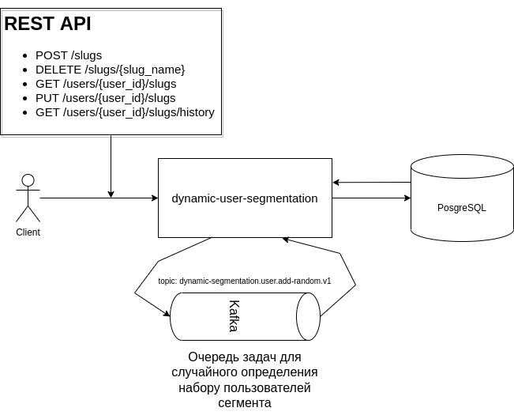
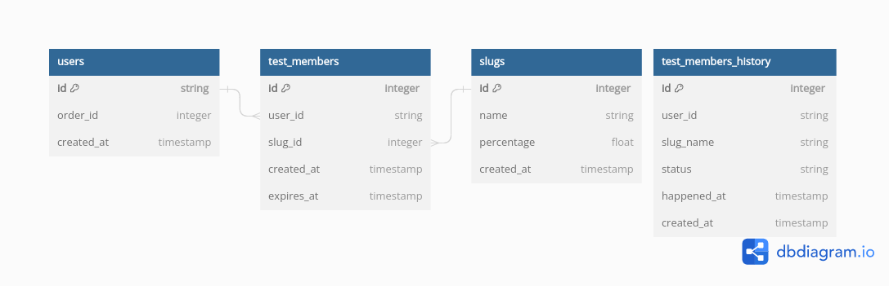

# dynamic-user-segmentation
Сервис, хранящий пользователя и сегменты, в которых он состоит (создание, изменение, удаление сегментов, а также добавление и удаление пользователей в сегмент).

## Оглавление

1. [Запуск сервиса](#Запуск-сервиса)
2. [Примеры запросов](#Примеры-запросов)
3. [Архитектура](#Архитектура)
4. [Функциональные требования](#Функциональные-требования)
5. [Трудности в дополнительных заданиях](#Трудности-в-дополнительных-заданиях)
                                                                                                

## Запуск сервиса

## Примеры запросов

## Архитектура
### Архитектура сервиса

### Структура БД

## Функциональные требования
#### 1. Создание сегмента - POST /api/public/v1/slugs
Тело запроса:

|   | Название   | Формат | Кратность | Описание                                                   |
|---|------------|--------|-----------|------------------------------------------------------------|
| 1 | slug_name  | string | 1         | уникальное название нового сегмента                        |
| 2 | percentage | float  | 0-1       | процент пользователей, которому определится данный сегмент |

#### 2. Удаление сегмента - DELETE /api/public/v1/slugs/{slug_name}
Параметры пути:

|   | Название  | Формат | Кратность | Описание                                |
|---|-----------|--------|-----------|-----------------------------------------|
| 1 | slug_name | string | 1         | уникальное название удаляемого сегмента |

#### 3. Добавление пользователя в сегменты - PUT /api/public/v1/users/{user_id}/slugs
Тело запроса:

|   | Название        | Формат       | Кратность | Описание                                                         |
|---|-----------------|--------------|-----------|------------------------------------------------------------------|
| 1 | slugs_to_delete | List[string] | 0-1       | список уникальных названий сегментов для добавления пользователю |
| 2 | slugs_to_add    | List[string] | 0-1       | список уникальных названий сегментов для удаления у пользователя |

Параметры пути:

|   | Название | Формат | Кратность | Описание                              |
|---|----------|--------|-----------|---------------------------------------|
| 1 | user_id  | string | 1         | уникальный идентификатор пользователя |

#### 4. Получение активных сегментов пользователя - GET /api/public/v1/users/{user_id}/slugs
Параметры пути:

|   | Название | Формат | Кратность | Описание                              |
|---|----------|--------|-----------|---------------------------------------|
| 1 | user_id  | string | 1         | уникальный идентификатор пользователя |

#### 5. Получение истории сегментов пользователя - GET /api/public/v1/users/{user_id}/slugs/history

Параметры пути:

|   | Название | Формат | Кратность | Описание                              |
|---|----------|--------|-----------|---------------------------------------|
| 1 | user_id  | string | 1         | уникальный идентификатор пользователя |

Параметры запроса:

|   | Название | Формат | Кратность | Описание                                                          |
|---|----------|--------|-----------|-------------------------------------------------------------------|
| 1 | begin    | string | 1         | начало периода по паттерну: "{год}-{месяц}" (год и месяц - числа) |
| 2 | end      | string | 1         | конец периода по паттерну: "{год}-{месяц}" (год и месяц - числа)  | 

## Трудности в дополнительных заданиях
